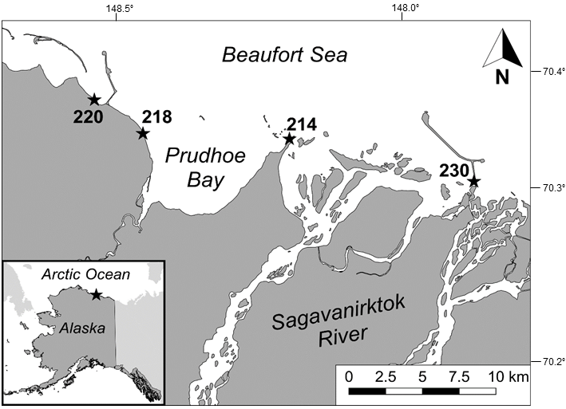

# Effects of Environmental Variables on a Nearshore Arctic Fish Community, 2001–2018

Long-term fish monitoring in the nearshore waters of the Arctic Ocean has revealed many changes occurring in the fish community. This work summarizes abundance data caught at four fyke net stations around Prudhoe Bay, off the Beaufort Sea. Paired together with environmental data from this project, as well as other regional data from USGS and NOAA, the effects of the environmental data on the nearshore Arctic fish community can be understood.   
Much of this work was originally performed for the M.S. thesis of J. Priest. 

## Abstract
Nearshore fish communities comprise a fundamental component of Arctic marine ecosystems and serve as an important subsistence resource. As changing climate conditions affect Arctic waters, nearshore fish communities may also shift; however, how these communities will respond to climate change is not well understood. This study summarizes trends from a long-term (2001–2018) nearshore fish sampling program in Prudhoe Bay, Alaska, in the central Beaufort Sea. Abundance data (_n_ = 1.78 million fish) from daily sampling (July–August) at four fixed sampling locations showed distinct shifts in fish community metrics. Since 2001, annual species richness has significantly increased by approximately one species per decade (p = 0.004) while water temperature has warmed by approximately 1.4°C. Results from non-metric multi-dimensional scaling (nMDS) and Permutational Analysis of Variance (PERMANOVA) models indicated that species composition based on biweekly catch data has significantly changed across years with distinct variations among sample locations and throughout the season. Salinity and water temperature significantly affected multivariate species composition; univariate species models showed that the abundances of five species changed significantly over time and were associated with changes in water temperature and salinity. The species positively associated with observed changes in the aquatic environment appear to be eurythermic and/or euryhaline generalist species such as Broad Whitefish _Coregonus nasus_ and Saffron Cod _Eleginus gracilis_. Such patterns of altered species compositions demonstrate that continued long-term changes in environmental conditions will likely favor generalist species, potentially causing substantial shifts within the Arctic nearshore ecosystem with impacts on important subsistence resources.